# Attempted Lab Fixes

Hopefully this will fix some of the larger lab issues for everyone.

## JService API

replace in random_question_fetch.dart:

```dart
static final String uri = "https://jservice.io/api/category?id=";
```

with:

```dart
static final String uri = "https://www.madmanvo.com/api/category?id=";
```

the formatting and answers aren't completely correct, but I am working on it.
this allows the high score to work and no changes for the actual api calls or multiple_choice_questions

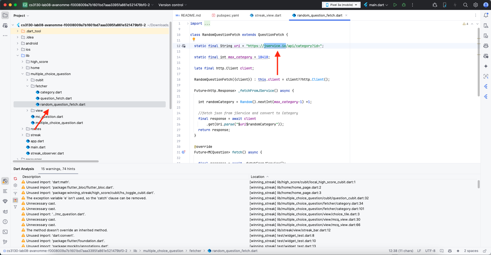
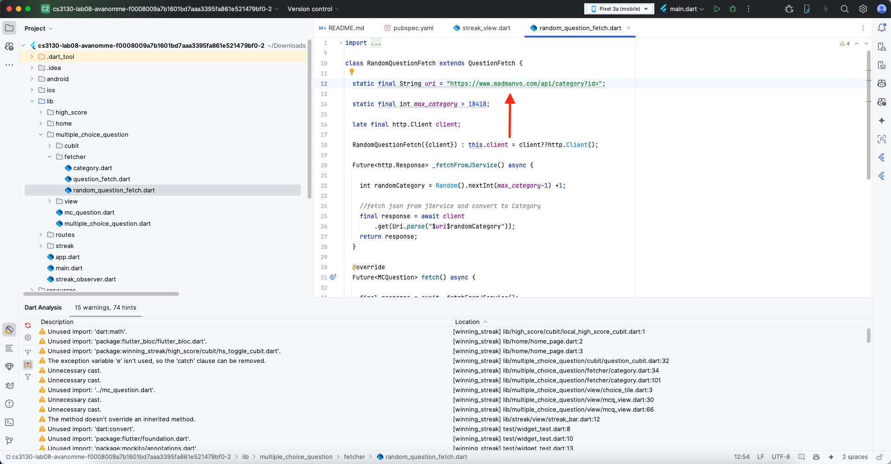

## Bloc Provider

If your Bloc Provider is giving errors:

In main.dart update the code as below:

```dart
import 'package:flutter/widgets.dart';
import 'package:flutter_bloc/flutter_bloc.dart';
import 'package:winning_streak/high_score/cubit/hs_toggle_cubit.dart';
import 'package:winning_streak/high_score/cubit/local_high_score_cubit.dart';
import 'app.dart';
import 'streak_observer.dart';

void main() {
	Bloc.observer = StreakObserver();

	runApp(MultiBlocProvider(
		providers: <BlocProvider>[
			BlocProvider<HSToggleCubit>(
				create: (_) => HSToggleCubit(HSToggleCubit.LOCAL),
			),
			BlocProvider<LocalHighScoreCubit>(
				create: (_) => LocalHighScoreCubit(),
			),
		],
		child: StreakApp(),
	));
}
```

this replaces `BlocOverrides.runZoned` since it was deprecated

## Deprecation Errors

### Scaffold.of

This one can cause the program not to run:

replace

```dart
Scaffold.of(context).showSnackBar
```

with

```dart
ScaffoldMessenger.of(context).showSnackBar
```

Scaffold.of(context).showSnackBar

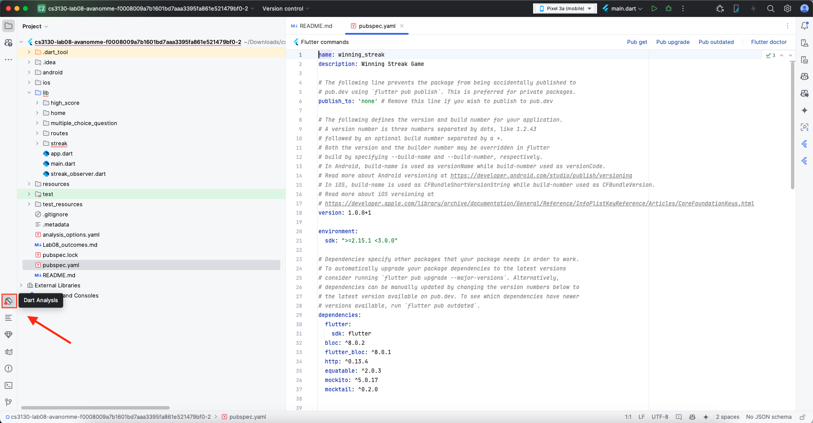
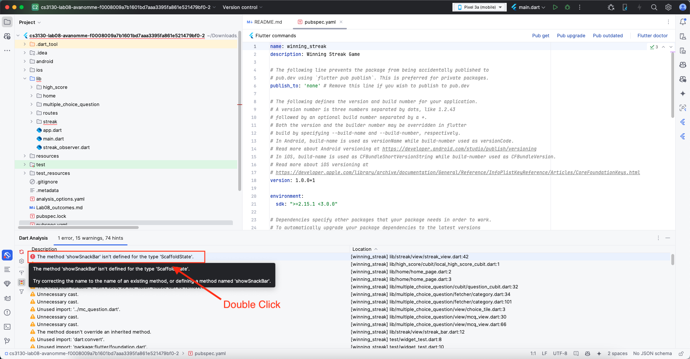
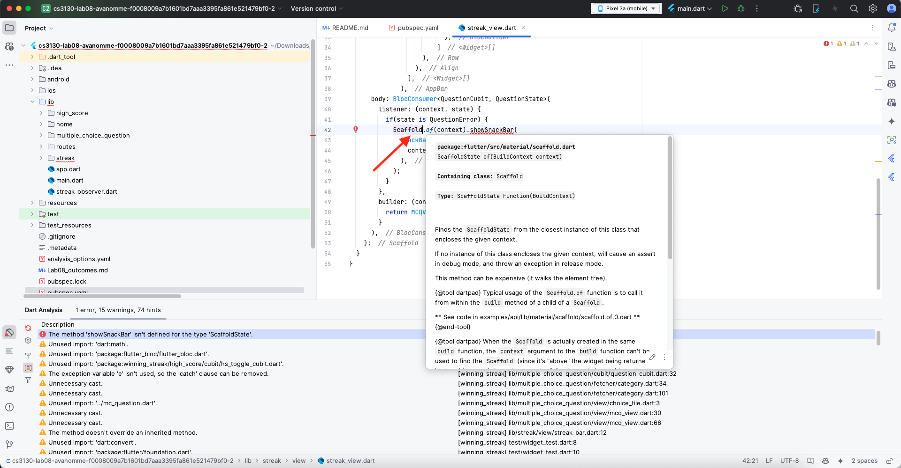
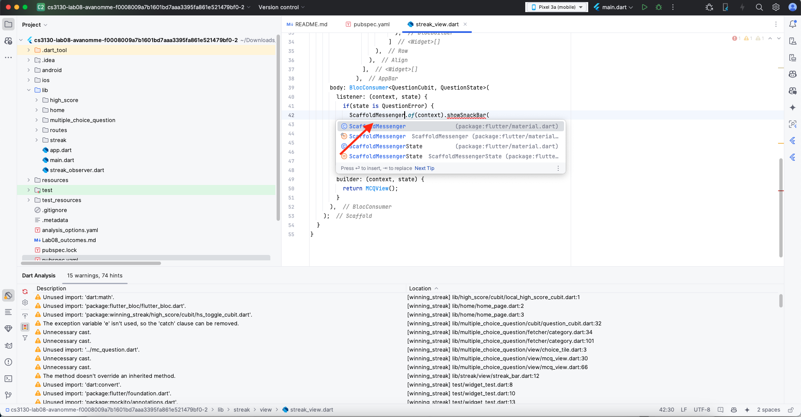

### textScaleFactor

Replace:

```dart
textScaleFactor: 2.0
```

with:

```dart
textScaler: const TextScaler.linear(2.0)
```

## Other possible fixes

For Project Components and SDK settings:
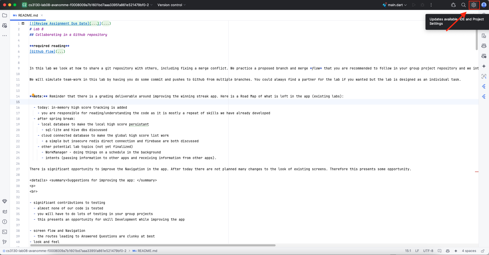
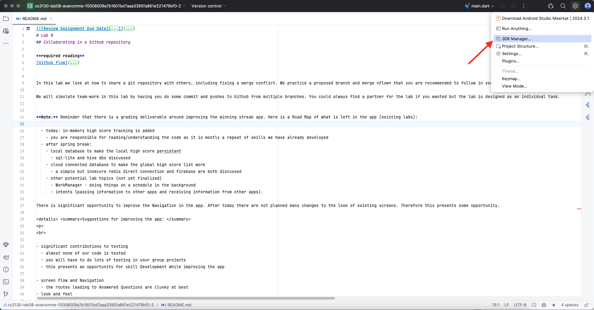
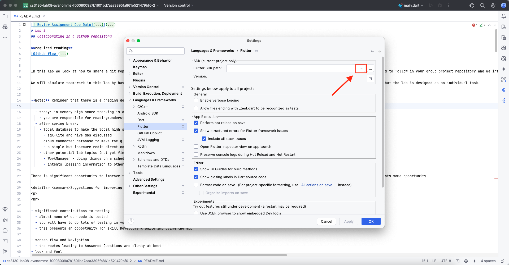
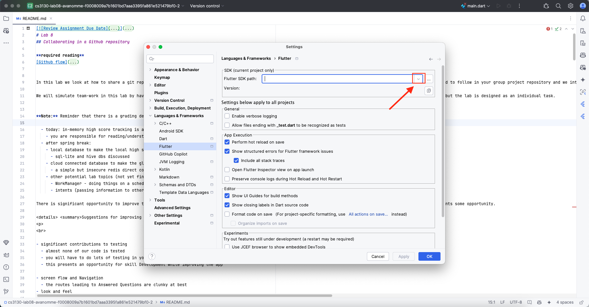
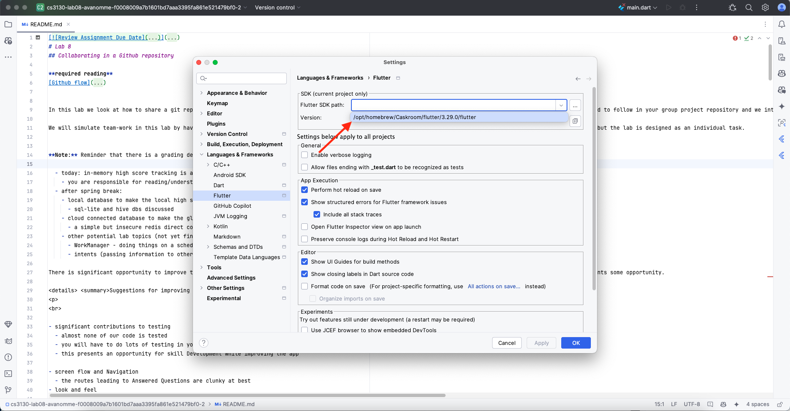
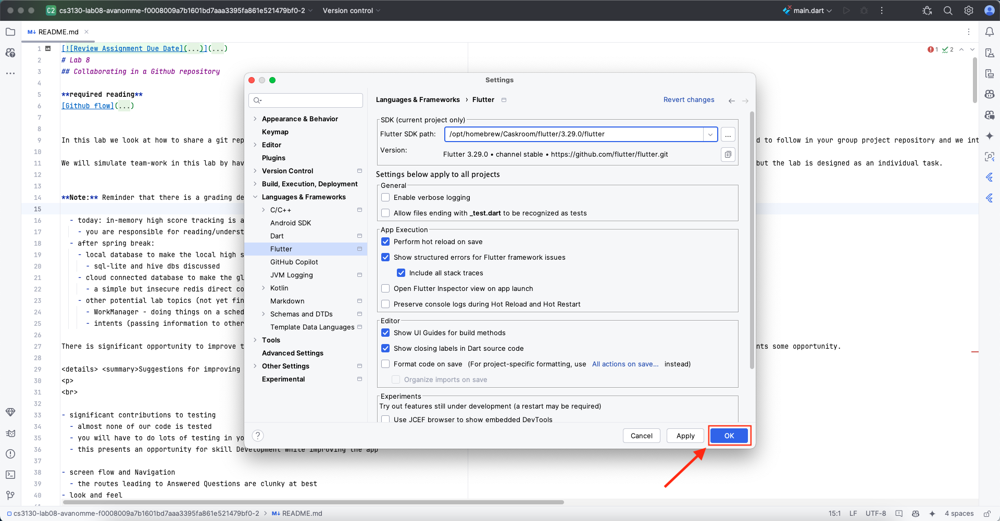

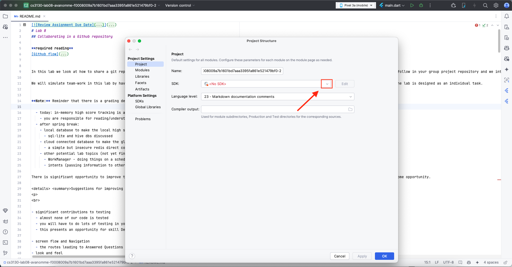
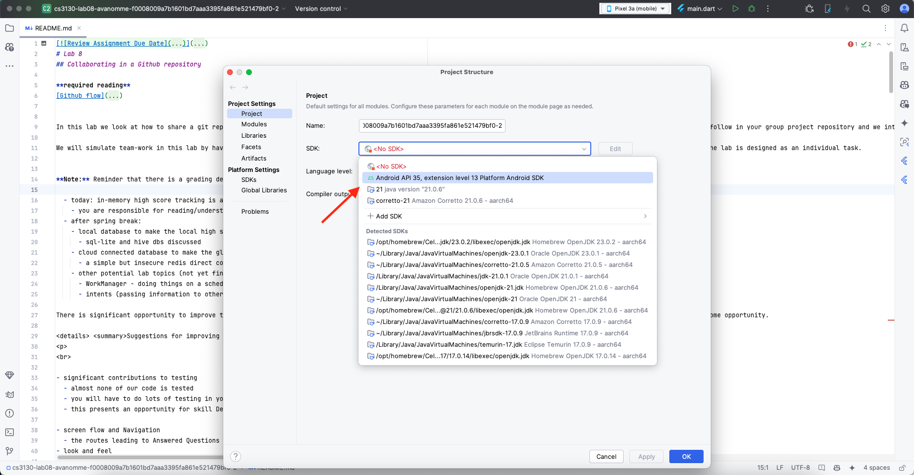
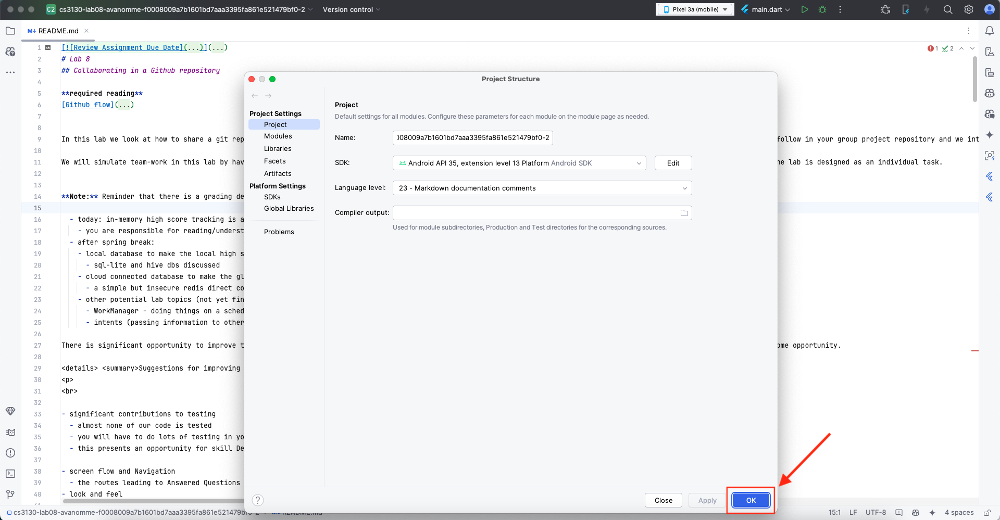

For Gradle Errors:
Delete Android Folder
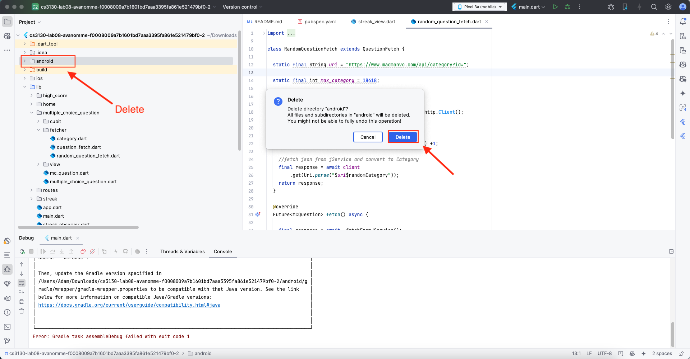
Open Terminal
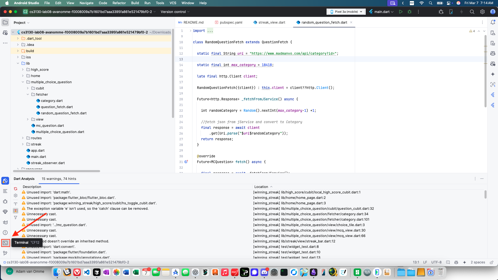
Create new android folder for project


## Flutter Pub
Don't Foget to run flutter pub and flutter update in pubspe.yaml